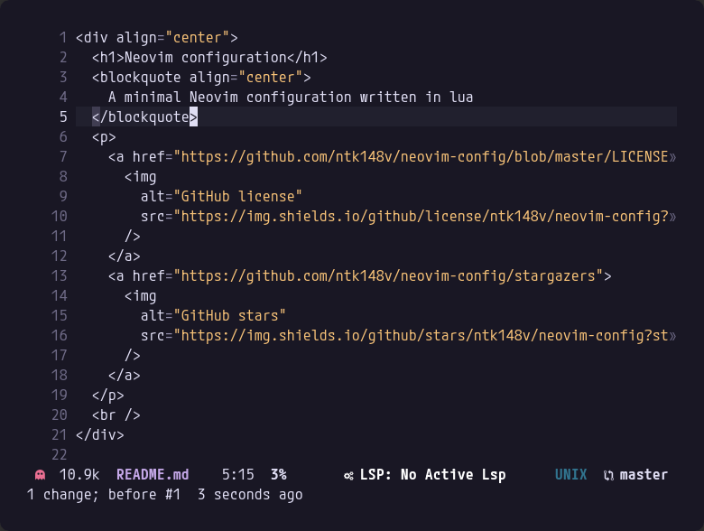
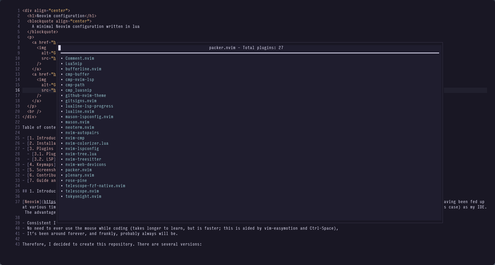
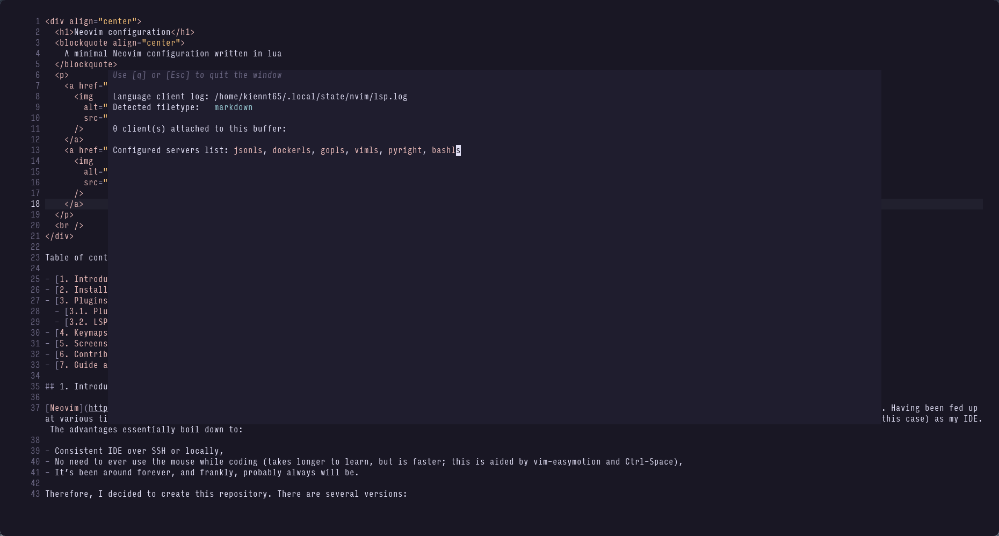
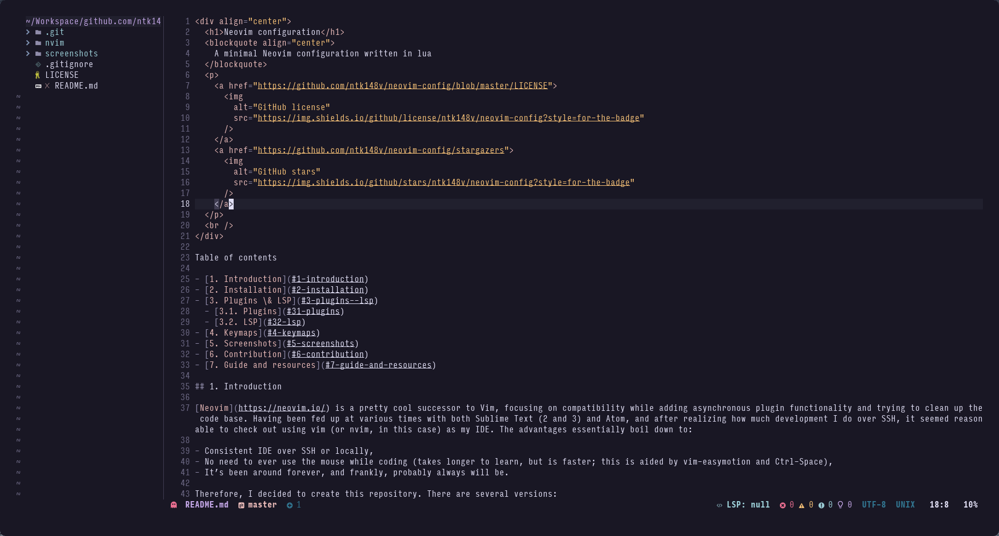
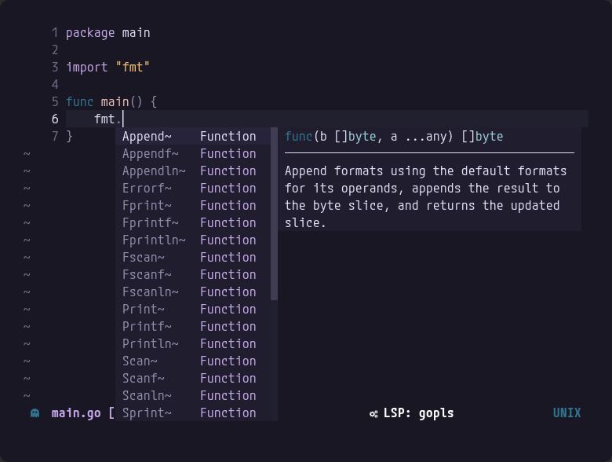
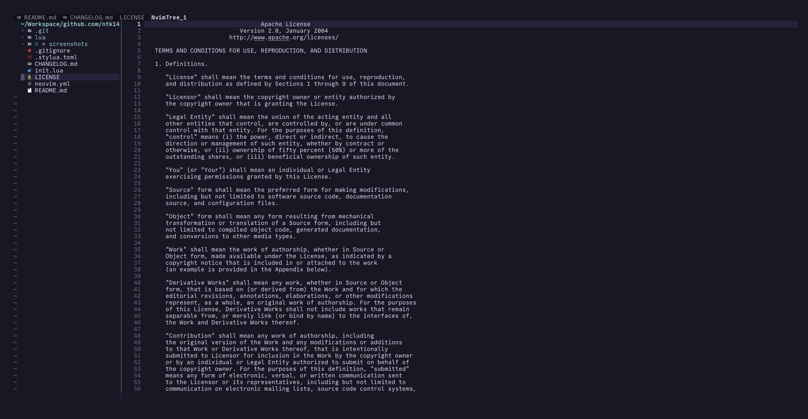

<div align="center">
  <h1>Neovim configuration</h1>
  <blockquote align="center">
    A minimal Neovim configuration written in lua
  </blockquote>
  <p>
        <a href="https://github.com/ntk148v/neovim-config/blob/master/LICENSE">
      
    </a>
    <a href="https://github.com/ntk148v/neovim-config/stargazers">
      
    </a>
    
    <a href="https://github.com/ntk148v/neovim-config/releases/latest">
        
    </a>
  </p>
  <br />
</div>

Table of contents

- [1. Introduction](#1-introduction)
- [2. Installation](#2-installation)
- [3. File structure](#3-file-structure)
- [4. Plugins \& LSP](#4-plugins--lsp)
  - [4.1. Plugins](#41-plugins)
  - [4.2. LSP](#42-lsp)
- [5. Keymaps](#5-keymaps)
- [6. Customization](#6-customization)
- [7. Screenshots](#7-screenshots)
- [8. Contribution](#8-contribution)
- [9. Guide and resources](#9-guide-and-resources)

## 1. Introduction

[Neovim](https://neovim.io/) is a pretty cool successor to Vim, focusing on compatibility while adding asynchronous plugin functionality and trying to clean up the code base. Having been fed up at various times with both Sublime Text (2 and 3) and Atom, and after realizing how much development I do over SSH, it seemed reasonable to check out using vim (or nvim, in this case) as my IDE. The advantages essentially boil down to:

- Consistent IDE over SSH or locally,
- No need to ever use the mouse while coding (takes longer to learn, but is faster; this is aided by vim-easymotion and Ctrl-Space),
- It’s been around forever, and frankly, probably always will be.

Therefore, I decided to create this repository. There are several versions, checkout [CHANGELOG](./CHANGELOG.md).

This configuration is meant as a starting point, and it fits my needs only. If you want to customize it, jump to [6. Customization](#6-customization).

## 2. Installation

- Requirements:
  - Install [neovim >= 0.8.0](https://github.com/neovim/neovim/wiki/Installing-Neovim#install-from-package), or you can [build it](https://github.com/neovim/neovim/wiki/Building-Neovim#) yourself.
  - git >= 2.19.0 (for partial clones support)
  - [fd](https://github.com/sharkdp/fd) and [ripgrep](https://github.com/BurntSushi/ripgrep).
  - I recommend using a [nerdfonts](https://www.nerdfonts.com/font-downloads) (optional)
- Backup your current neovim config, if necessary:

```shell
mv ~/.config/nvim ~/.config/nvim.bak
```

- Neovim's configurations are located under the following paths, depending on your OS:

| OS                   | PATH                                      |
| :------------------- | :---------------------------------------- |
| Linux, MacOS         | `$XDG_CONFIG_HOME/nvim`, `~/.config/nvim` |
| Windows (cmd)        | `%localappdata%\nvim\`                    |
| Windows (powershell) | `$env:LOCALAPPDATA\nvim\`                 |

- [Fork](https://docs.github.com/en/get-started/quickstart/fork-a-repo) this repo so that you have your own copy that you can modify, then install by cloning the fork to your machine using one of the commands below, depending on your OS.

> **NOTE**
> Your fork's url will be something like this:
> `https://github.com/<your_github_username>/neovim-config.git`

- Get your configuration:

> **NOTE**
> If following the recommended step above (i.e., forking the repo), replace
> `ntk148v` with `<your_github_username>` in the commands below

<details><summary> Linux and Mac </summary>

```shell
git clone https://github.com/ntk148v/neovim-config.git "${XDG_CONFIG_HOME:-$HOME/.config}"/nvim
```

</details>

<details><summary> Windows </summary>

If you're using `cmd.exe`:

```shell
git clone https://github.com/ntk148v/neovim-config.git "%localappdata%\nvim"
```

If you're using `powershell.exe`

```shell
git clone https://github.com/ntk148v/neovim-config.git "${env:LOCALAPPDATA}\nvim"
```

</details>

- Start Neovim, Lazy should be installed automatically, then it will install plugins.

```shell
nvim
```

- Restart Neovim and enjoy it.
- Keep updated: You should keep updated using `git pull`.

## 3. File structure

The files under config will be automatically loaded at the appropriate time, so you don't need to require those files manually.

```shell
tree ~/.config/nvim
├── init.lua
├── lazy-lock.json
└── lua
    ├── autocmds.lua
    ├── custom.lua
    ├── mappings.lua
    ├── options.lua
    ├── plugins
    │   ├── configs
    │   │   ├── cmp.lua
    │   │   ├── gitsigns.lua
    │   │   ├── lspconfig.lua
    │   │   ├── lualine.lua
    │   │   ├── luasnip.lua
    │   │   ├── mason.lua
    │   │   ├── null-ls.lua
    │   │   ├── telescope.lua
    │   │   ├── tree.lua
    │   │   └── treesitter.lua
    │   └── init.lua
    └── sample_custom.lua
```

## 4. Plugins & LSP

### 4.1. Plugins

| Plugin                                                                            | Description                                                                                                                                        |
| --------------------------------------------------------------------------------- | -------------------------------------------------------------------------------------------------------------------------------------------------- |
| [lazy.nvim](https://github.com/folke/lazy.nvim)                                   | A modern plugin manager for Neovim                                                                                                                 |
| [mason.nvim](https://github.com/williamboman/mason.nvim)                          | Portable package manager for Neovim that runs everywhere Neovim runs. Easily install and manage LSP servers, DAP servers, linters, and formatters. |
| [nvim-lspconfig](https://github.com/neovim/nvim-lspconfig)                        | A collection of common configurations for Neovim's built-in language server client                                                                 |
| [gitsigns](https://github.com/lewis6991/gitsigns.nvim)                            | Super fast git decorations implemented purely in lua/teal                                                                                          |
| [nvim-treesitter](https://github.com/nvim-treesitter/nvim-treesitter)             | Nvim Treesitter configurations and abstraction layer                                                                                               |
| [nvim-cmp](https://github.com/hrsh7th/nvim-cmp)                                   | Auto completion plugin                                                                                                                             |
| [LuaSnip](https://github.com/L3MON4D3/LuaSnip)                                    | Snippet Engine for Neovim written in Lua                                                                                                           |
| [nvim-tree.lua](https://github.com/kyazdani42/nvim-tree.lua) -                    | A File Explorer written In Lua                                                                                                                     |
| [nvim-autopairs](https://github.com/windwp/nvim-autopairs)                        | A super powerful autopairs for Neovim                                                                                                              |
| [nvim-web-devicons](https://github.com/nvim-tree/nvim-web-devicons)               | Lua `fork` of vim-web-devicons for neovim                                                                                                          |
| [lualine.nvim](https://github.com/nvim-lualine/lualine.nvim)                      | A blazing fast and easy to configure neovim statusline plugin written in pure lua.                                                                 |
| [norcalli/nvim-colorizer.lua](https://github.com/norcalli/nvim-colorizer.lua)     | The fastest Neovim colorizer.                                                                                                                      |
| [nvim-telescope/telescope.nvim](https://github.com/nvim-telescope/telescope.nvim) | Find, Filter, Preview, Pick. All lua, all the time.                                                                                                |
| [rosé-pine](https://github.com/rose-pine/neovim)                                  | Soho vibes for Neovim                                                                                                                              |
| [nvimtools/none-ls.nvim](nvimtools/none-ls.nvim)                                  | null-ls.nvim reloaded / Use Neovim as a language server to inject LSP diagnostics, code actions, and more via Lua.                                 |
| [folke/which-key.nvim](https://github.com/folke/which-key.nvim)                   | Create key bindings that stick. WhichKey helps you remember your Neovim keymaps, by showing available keybindings in a popup as you type.          |

### 4.2. LSP

By default, the follow LSP servers are installed and configured:

- python - [ruff_lsp](https://github.com/neovim/nvim-lspconfig/blob/master/doc/server_configurations.md#ruff_lsp)
- golang - [gopls](https://github.com/neovim/nvim-lspconfig/blob/master/doc/server_configurations.md#gopls)
- docker - [dockerls](https://github.com/neovim/nvim-lspconfig/blob/master/doc/server_configurations.md#dockerls)
- bash - [bashls](https://github.com/neovim/nvim-lspconfig/blob/master/doc/server_configurations.md#bashls)
- vim - [vimls](https://github.com/neovim/nvim-lspconfig/blob/master/doc/server_configurations.md#vimls)
- yaml - [yamlls](https://github.com/neovim/nvim-lspconfig/blob/master/doc/server_configurations.md#yamlls)
- json - [jsonls](https://github.com/neovim/nvim-lspconfig/blob/master/doc/server_configurations.md#jsonls)

Furthermore, it integrates with [nvim-treesitter](https://github.com/nvim-treesitter/nvim-treesitter) to provide rich syntax highlighting and other language parsing magic.

If your language is not supported, please follow this:

- Check if LSP support is available in the [lspconfig repo](https://github.com/neovim/nvim-lspconfig/blob/master/doc/server_configurations.md). To install a supported language server with [mason](https://github.com/williamboman/mason.nvim):

```vim
:LspInstall `<your_language_server>`
```

- Check if your syntax is supported in the [treesitter repo](https://github.com/nvim-treesitter/nvim-treesitter). To install a language syntax highlight, run:

```vim
:TSInstall `<language_to_install>`
```

You can add more LSP servers and language syntax highlighting by editing the custom file.

## 5. Keymaps

These are the default keymaps, in the following shortcuts, the `<leader>`+` key is set up to `` (space) character, check: [keymaps.lua](./nvim/lua/core/keymaps.lua).

| Shortcut                       | Mode   | Description                                   |
| ------------------------------ | ------ | --------------------------------------------- |
| <kbd>kk</kbd>                  | Insert | Esc with `kk`                                 |
| `<leader>`+<kbd>r</kbd>        | Normal | Reload configuration file                     |
| `<leader>`+<kbd>s</kbd>        | Normal | Save file                                     |
| `<leader>`+<kbd>q</kbd>        | Normal | Save (close all windows) and exit from Neovim |
| `<leader>`+<kbd>n</kbd>        | Normal | Open NvimTree                                 |
| `<leader>`+<kbd>nr</kbd>       | Normal | Refresh NvimTree                              |
| `<leader>`+<kbd>nf</kbd>       | Normal | Find file in NvimTree                         |
| `<leader>`+<kbd>ff</kbd>       | Normal | Open Telescope to find files                  |
| `<leader>`+<kbd>fg</kbd>       | Normal | Open Telescope to do live grep                |
| `<leader>`+<kbd>fb</kbd>       | Normal | Open Telescope to list buffers                |
| `<leader>`+<kbd>fh</kbd>       | Normal | Open Telescope to show help                   |
| `<leader>`+<kbd>fo</kbd>       | Normal | Open Telescope to show recent opened files    |
| `<leader>`+<kbd>cm</kbd>       | Normal | Open Telescope to list git commits            |
| `<leader>`+<kbd>wh/j/k/l</kbd> | Normal | Move around splits                            |
| <kbd>mm</kbd>                  | Normal | Comment/Uncomment line                        |

There are many default keymaps, you can check it using `:map` command. There are also other variants:

- `:nmap` for normal mode mappings
- `:vmap` for visual mode mappings
- `:imap` for insert mode mappings

The above list is not complete. Typing `:help map` in Vim will give you more info.

## 6. Customization

You can customize this configuration by creating the `custom` module. You can choose either two ways:

- Create `${XDG_CONFIG_HOME:-$HOME/.config}/nvim/lua/custom.lua` file.
- Create module `${XDG_CONFIG_HOME:-$HOME/.config}/nvim/lua/custom/` if your custom configuration is too long, and you want to separate it into multiple files.

Checkout the [sample custom](./nvim/lua/sample_custom.lua) file for the starting point. The logic is taken from [CyberNvim](https://github.com/pgosar/CyberNvim/wiki/Configuration#predefined-sections). There are a number of defined sections in the config:

- `M.setup_sources` is used to add extra sources to connect to Null-ls - you can find a list of sources [here](https://github.com/nvimtools/none-ls.nvim/blob/main/doc/BUILTINS.md). The parameter b is just short for null_ls.builtins.
- `M.ensure_installed` is used to add extra [Treesitter](https://github.com/nvim-treesitter/nvim-treesitter) highlighter.
- `M.plugins` is where you will add your own plugin definitions.
- `M.configs` is the most important section of your own configuration. This is where you can define any autocommands, require any files, or otherwise completely port your current configuration.
- `M.formatting_servers` is used to setup auto formatting rules. You need to select the language server that will provide autoformatting capabilities

## 7. Screenshots

|                                                                        |                                                                        |
| ---------------------------------------------------------------------- | ---------------------------------------------------------------------- |
|  |  |
|  |  |
|  |  |

## 8. Contribution

Feel free to file an issue or open a pull request. You're welcome!

## 9. Guide and resources

- [nanotee/nvim-lua-guide](https://github.com/nanotee/nvim-lua-guide)
- [brainfucksec/neovim-lua](https://github.com/brainfucksec/neovim-lua)
- [LunarVim/Neovim-from-scratch](https://github.com/LunarVim/Neovim-from-scratch)
- [LunarVim/nvim-basic-ide](https://github.com/LunarVim/nvim-basic-ide)
